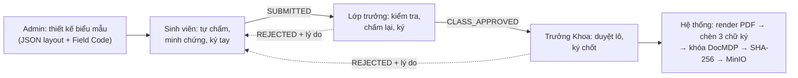
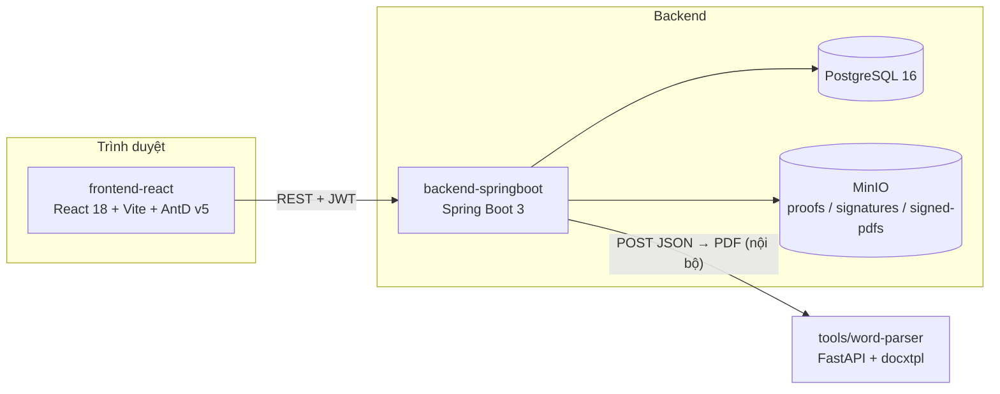
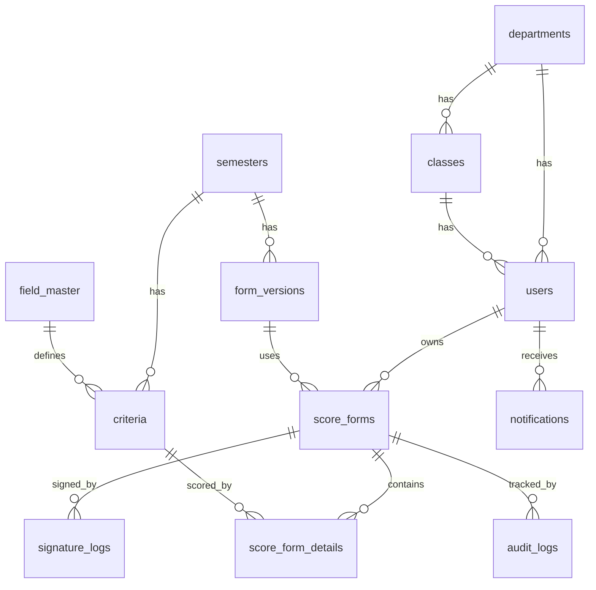
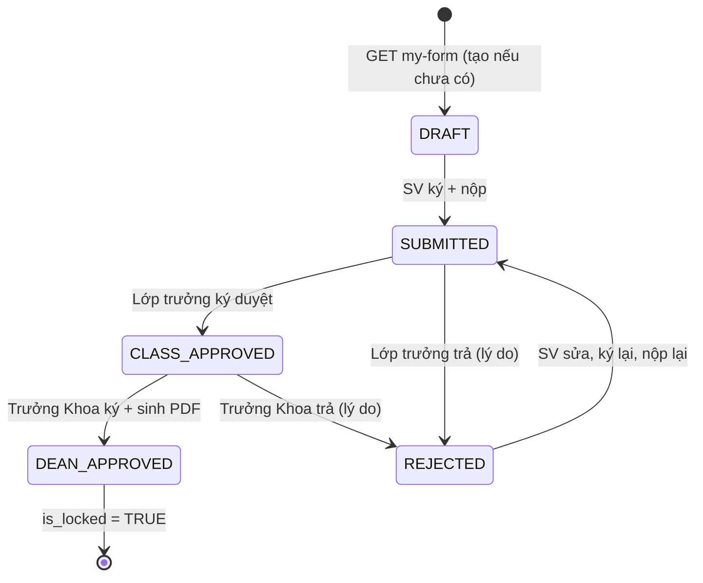
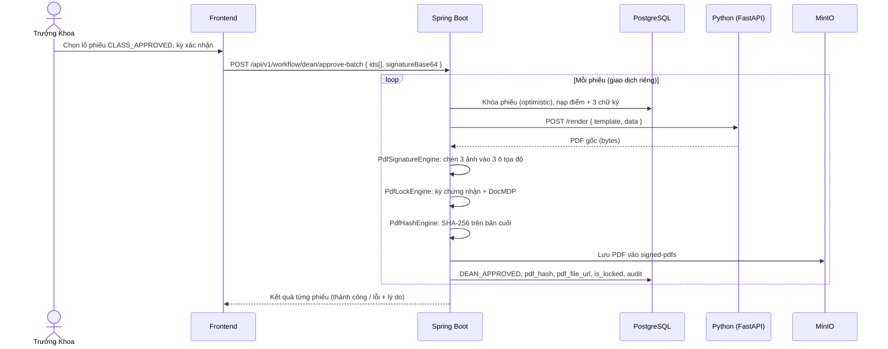

# CONTEXT.MD: HỆ THỐNG E-FORM ĐIỂM RÈN LUYỆN ĐẠI HỌC (E-DRL)

> **Phiên bản:** 2.0 — tái cấu trúc backend từ NodeJS/MongoDB sang **Spring Boot 3 + PostgreSQL**
> **Cập nhật:** 02/10/2026
> **Mục đích:** Nguồn sự thật (single source of truth) về nghiệp vụ, kiến trúc, dữ liệu và quy ước kỹ thuật. Dán file này vào ngữ cảnh khi nhờ AI (Cursor/Copilot/Claude) sinh code. Kế hoạch triển khai nằm ở `task.md`; cấu trúc thư mục chi tiết nằm ở `project_structure.md`.

> 🔒 **Bảo mật:** tài liệu chỉ dùng placeholder (`<JWT_SECRET>`, `<MINIO_ACCESS_KEY>`, `<KEYSTORE_PASSWORD>`...). Không commit giá trị thật.

---

## Mục lục

1. [Tổng quan & mục tiêu](#1-tổng-quan--mục-tiêu)
2. [Vai trò & phân quyền](#2-vai-trò--phân-quyền)
3. [Tech stack](#3-tech-stack)
4. [Kiến trúc hệ thống](#4-kiến-trúc-hệ-thống)
5. [Cấu trúc Monorepo](#5-cấu-trúc-monorepo)
6. [Thiết kế cơ sở dữ liệu (12 bảng)](#6-thiết-kế-cơ-sở-dữ-liệu-12-bảng)
7. [Enum & máy trạng thái](#7-enum--máy-trạng-thái)
8. [Workflow ký số & toàn vẹn hồ sơ](#8-workflow-ký-số--toàn-vẹn-hồ-sơ)
9. [Hợp đồng giao tiếp Spring Boot ↔ Python](#9-hợp-đồng-giao-tiếp-spring-boot--python)
10. [Danh mục API (RESTful)](#10-danh-mục-api-restful)
11. [Quy ước kỹ thuật bắt buộc](#11-quy-ước-kỹ-thuật-bắt-buộc)
12. [Báo cáo & xuất Excel](#12-báo-cáo--xuất-excel)
13. [Cấu hình & biến môi trường](#13-cấu-hình--biến-môi-trường)
14. [Chiến lược kiểm thử](#14-chiến-lược-kiểm-thử)
15. [Quyết định thiết kế & rủi ro đã biết](#15-quyết-định-thiết-kế--rủi-ro-đã-biết)
16. [Hiện trạng & kế thừa từ bản NodeJS](#16-hiện-trạng--kế-thừa-từ-bản-nodejs)

---

## 1. Tổng quan & mục tiêu

**E-DRL** số hóa quy trình đánh giá điểm rèn luyện (ĐRL) của sinh viên qua 3 cấp tuần tự, kết quả cuối là **một file PDF đã ký 3 cấp, có mã băm SHA-256 và bị khóa chống chỉnh sửa**.

### 3 bài toán lõi

| # | Bài toán | Mô tả | Người dùng |
|---|---|---|---|
| 1 | **Form Builder** | Admin tự thiết kế biểu mẫu động; layout lưu dạng JSON, có phiên bản | `ADMIN` |
| 2 | **Tự chấm & ký tay** | Sinh viên kê khai điểm, đính kèm minh chứng, ký tay trên canvas | `STUDENT` |
| 3 | **Duyệt & ký số 3 cấp** | Lớp, Khoa duyệt qua giao diện Split-screen; hệ thống đóng 3 chữ ký, băm SHA-256, khóa PDF (DocMDP) | `CLASS_LEADER`, `DEAN` |

### Luồng nghiệp vụ tổng quát



---

## 2. Vai trò & phân quyền

| Role | Mô tả | Quyền chính | Phạm vi dữ liệu |
|---|---|---|---|
| `STUDENT` | Sinh viên | Soạn, lưu nháp, ký, nộp phiếu; xem lịch sử | Chỉ phiếu của chính mình |
| `CLASS_LEADER` | Lớp trưởng | Xem hàng đợi lớp, chấm lại điểm, ký duyệt cấp Lớp, trả phiếu | Lớp mình (`class_id` trong JWT) |
| `DEAN` | Trưởng Khoa | Duyệt lô cấp Khoa, ký chốt, xem báo cáo khoa | Khoa mình (`dept_id` trong JWT) |
| `ADMIN` | Phòng Đào tạo / CTSV | Quản trị user, danh bạ, Field Code, Form Builder, báo cáo toàn trường | Toàn trường |

**JWT claims:** `sub` (userId), `role`, `deptId`, `classId`, `iat`, `exp`.

**Ràng buộc truy cập theo dữ liệu (không chỉ theo role):** `@PreAuthorize` chỉ kiểm tra role; service **phải** kiểm tra thêm phạm vi (phiếu thuộc lớp/khoa của người gọi). Vi phạm → `403 FORBIDDEN_SCOPE`.

---

## 3. Tech stack

| Phân hệ | Công nghệ | Vai trò |
|---|---|---|
| **Frontend** | React 18, Vite | SPA |
| | Ant Design v5 | UI library |
| | Zustand | State theo domain |
| | React Hook Form | Form + validate |
| | react-signature-canvas | Ký tay → PNG base64 |
| | Axios | HTTP client (+ interceptor JWT, 401/403) |
| **Backend** | Spring Boot 3, Java 17 | REST API |
| | PostgreSQL 16, Spring Data JPA | Lưu trữ, CRUD qua `JpaRepository` |
| | Hibernate Criteria API | Lọc động đa chiều (`hibernateDao/`) |
| | Flyway | Migration schema có phiên bản |
| | Spring Security + JWT (jjwt) | Xác thực, RBAC 4 role |
| | Jakarta Validation | Validate DTO (`@Valid`) |
| | Apache PDFBox | Chèn ảnh chữ ký, khóa DocMDP |
| | Apache POI | Import/Export Excel |
| | MinIO Java SDK | Object storage |
| | springdoc-openapi | Swagger UI cho API |
| | JUnit 5, Mockito, Testcontainers | Kiểm thử |
| **Python Microservice** | FastAPI, `docxtpl` | Map JSON vào phôi Word → xuất PDF |
| **Hạ tầng** | Docker, Docker Compose | PostgreSQL, MinIO, backend, python, frontend (Nginx) |

> Ghi chú: Flyway, springdoc, Testcontainers là **bổ sung đề xuất** để hoàn thiện quy trình; không bắt buộc nếu nhóm muốn tinh giản.

---

## 4. Kiến trúc hệ thống



**Nguyên tắc kiến trúc**

| Nguyên tắc | Nội dung |
|---|---|
| Phân tầng | `controller → service → dao / hibernateDao`, `service/engine` cho PDF & Python |
| Python chỉ nội bộ | Chỉ Spring Boot gọi Python; frontend **không** gọi trực tiếp; không expose cổng Python ra ngoài Docker network |
| Entity không ra ngoài | Luôn dùng DTO ở `dto/request/` và `dto/response/` |
| Response thống nhất | Mọi controller trả `ApiResponse<T>` qua `Wrapper/` |
| File không lưu DB | DB chỉ giữ object key/URL; file ở MinIO |

---

## 5. Cấu trúc Monorepo

```text
drl-eform/
├── frontend-react/
│   └── src/
│       ├── common/                # constants, messages, permission-config, theme
│       ├── components/
│       │   ├── form-builder/      # Designer, Renderer, blocks, field-code
│       │   ├── signature/         # bọc react-signature-canvas
│       │   ├── split-screen/      # layout 2 cột đối soát
│       │   └── ui/
│       ├── lib/axios/             # client.js, api-paths.js
│       ├── pages/                 # login, admin, student, class-leader, dean, verify
│       ├── services/              # gọi API (đổi page 1-based → 0-based tại đây)
│       └── stores/                # Zustand
├── backend-springboot/
│   └── src/main/java/<base.package>/
│       ├── Wrapper/               # ApiResponse, PageWrapper
│       ├── controller/
│       ├── dao/                   # JpaRepository
│       ├── hibernateDao/          # Criteria API: lọc động
│       ├── dto/request/ , dto/response/
│       ├── enu/
│       ├── model/                 # Entity JPA
│       ├── security/
│       └── service/
│           └── engine/            # PythonRenderClient, PdfSignatureEngine,
│                                  # PdfLockEngine, PdfHashEngine
├── tools/word-parser/             # main.py (FastAPI), templates/*.docx
├── docker-compose.yml
├── context.md
├── task.md
└── project_structure.md
```

---

## 6. Thiết kế cơ sở dữ liệu (12 bảng)

PostgreSQL 16. Khóa chính `BIGSERIAL` (hoặc `UUID` nếu nhóm thống nhất). Thời gian dùng `TIMESTAMPTZ`. Tên bảng/cột `snake_case`; Entity ở `model/` dùng `@Table`/`@Column` ánh xạ tương ứng.

| # | Bảng | Cột chính | Ràng buộc / ghi chú |
|---|---|---|---|
| 1 | `departments` | `id`, `dept_code`, `dept_name`, `created_at` | `dept_code` UNIQUE |
| 2 | `classes` | `id`, `class_code`, `class_name`, `dept_id`, `academic_cohort`, `created_at` | `class_code` UNIQUE; FK → departments |
| 3 | `users` | `id`, `user_code`, `full_name`, `email`, `password_hash`, `role`, `position_title`, `dept_id`, `class_id`, `academic_cohort`, `is_signer`, `signature_specimen_url`, `is_active`, `created_at` | `user_code`, `email` UNIQUE; `role` ∈ enum `Role` |
| 4 | `semesters` | `id`, `semester_code`, `semester_name`, `academic_year`, `is_active`, `start_date`, `end_date` | `semester_code` UNIQUE; tối đa 1 học kỳ `is_active` |
| 5 | `field_master` | `id`, `field_code`, `field_name`, `data_type`, `category`, `is_required`, `min_value`, `max_value`, `regex_pattern`, `description`, `is_active`, `created_at` | `field_code` UNIQUE snake_case; `data_type` ∈ `STRING, NUMBER, DATE, BOOLEAN, ARRAY, FILE, SIGNATURE` |
| 6 | `form_versions` | `id`, `form_code`, `form_name`, `version_no`, `semester_id`, `template_layout_json` (JSONB), `status`, `created_by`, `created_at` | UNIQUE (`form_code`, `version_no`); tối đa 1 `ACTIVE` / (`form_code`, `semester_id`) |
| 7 | `criteria` | `id`, `semester_id`, `field_id`, `criteria_code`, `title`, `category`, `max_score`, `requires_proof`, `order_index` | FK → semesters, field_master |
| 8 | `score_forms` | `id`, `student_id`, `semester_id`, `form_version_id`, `status`, `student_total`, `class_total`, `final_total`, `ranking`, `reject_reason`, `pdf_file_url`, `pdf_hash_sha256`, `is_locked`, `version` (@Version), `created_at`, `updated_at` | UNIQUE (`student_id`, `semester_id`); `version` cho optimistic locking |
| 9 | `score_form_details` | `id`, `score_form_id`, `criteria_id`, `student_score`, `class_score`, `proof_url`, `note` | UNIQUE (`score_form_id`, `criteria_id`) |
| 10 | `signature_logs` | `id`, `score_form_id`, `signer_id`, `signer_role`, `sign_order`, `signature_img_url`, `sha256_hash`, `signed_at`, `ip_address`, `is_revoked` | `sign_order`: 1=SV, 2=Lớp, 3=Khoa; `is_revoked` = TRUE khi phiếu bị trả lại |
| 11 | `notifications` | `id`, `user_id`, `title`, `content`, `type`, `link_url`, `is_read`, `created_at` | `type` ∈ `SYSTEM, REJECT, APPROVE, REMINDER, SUBMIT` |
| 12 | `audit_logs` | `id`, `score_form_id`, `user_id`, `action`, `from_status`, `to_status`, `note`, `created_at` | Chỉ INSERT, không UPDATE/DELETE |

> **Bổ sung so với bản cũ:** `users.is_active`, `score_forms.version`, `signature_logs.is_revoked`, thêm `SUBMIT` vào `notifications.type`. Các cột còn lại giữ nguyên.

**Chỉ mục khuyến nghị:** `score_forms(semester_id, status)`, `score_forms(student_id)`, `users(class_id, role)`, `users(dept_id, role)`, `criteria(semester_id, order_index)`, `notifications(user_id, is_read)`.

**Sơ đồ quan hệ chính**



---

## 7. Enum & máy trạng thái

**Enum (`enu/`)**

| Enum | Giá trị |
|---|---|
| `Role` | `STUDENT`, `CLASS_LEADER`, `DEAN`, `ADMIN` |
| `ScoreFormStatus` | `DRAFT`, `SUBMITTED`, `CLASS_APPROVED`, `DEAN_APPROVED`, `REJECTED` |
| `FormVersionStatus` | `DRAFT`, `ACTIVE`, `INACTIVE` |
| `FieldDataType` | `STRING`, `NUMBER`, `DATE`, `BOOLEAN`, `ARRAY`, `FILE`, `SIGNATURE` |
| `NotificationType` | `SYSTEM`, `REJECT`, `APPROVE`, `REMINDER`, `SUBMIT` |
| `SignOrder` | `1=STUDENT`, `2=CLASS_LEADER`, `3=DEAN` |

**Máy trạng thái phiếu điểm**



**Bảng chuyển trạng thái (nguồn chuẩn cho `WorkflowService`)**

| Từ | Đến | Ai thực hiện | Điều kiện | Tác dụng phụ |
|---|---|---|---|---|
| (chưa có) | `DRAFT` | `STUDENT` | Học kỳ đang `is_active`, có form `ACTIVE` | Tạo `score_forms` + `score_form_details` rỗng |
| `DRAFT`/`REJECTED` | `SUBMITTED` | `STUDENT` (chủ phiếu) | Tổng `student_total` ≤ 100; mọi tiêu chí `requires_proof` đã có `proof_url`; có chữ ký | Lưu chữ ký MinIO; ghi `signature_logs` order=1; audit; thông báo Lớp trưởng |
| `SUBMITTED` | `CLASS_APPROVED` | `CLASS_LEADER` (đúng lớp) | `class_total` ≤ 100; có chữ ký | `class_score` cập nhật; `signature_logs` order=2; audit; thông báo |
| `SUBMITTED`/`CLASS_APPROVED` | `REJECTED` | `CLASS_LEADER` / `DEAN` | **Bắt buộc** `reject_reason` | Đánh dấu `is_revoked=TRUE` các chữ ký cũ; audit; thông báo `REJECT` tới SV |
| `CLASS_APPROVED` | `DEAN_APPROVED` | `DEAN` (đúng khoa) | Pipeline PDF thành công | `signature_logs` order=3; `pdf_file_url`, `pdf_hash_sha256`, `is_locked=TRUE`; audit; thông báo `APPROVE` |

**Quy tắc bất biến**

- Phiếu `is_locked = TRUE` → mọi API ghi trả `409 FORM_LOCKED`.
- Mọi chuyển trạng thái chạy trong `@Transactional` và ghi **đúng một** dòng `audit_logs`.
- Dùng `@Version` (optimistic locking) để chặn duyệt trùng; xung đột → `409 CONCURRENT_UPDATE`.
- Điểm: `0 ≤ score ≤ criteria.max_score`; tổng ≤ 100.
- **Xếp loại** (cấu hình được, mặc định theo quy chế phổ biến): ≥90 Xuất sắc; 80–<90 Tốt; 65–<80 Khá; 50–<65 Trung bình; 35–<50 Yếu; <35 Kém. Bảng ngưỡng đặt trong `application.yml`, **không hard-code**. Cần xác nhận lại với quy chế của trường.

---

## 8. Workflow ký số & toàn vẹn hồ sơ

### 8.1 Pipeline khi Trưởng Khoa duyệt (`service/engine/`)



### 8.2 Thứ tự bước (không đảo)

| Bước | Engine | Lý do |
|---|---|---|
| 1 | `PythonRenderClient` | Cần PDF gốc từ phôi Word |
| 2 | `PdfSignatureEngine` | Chèn 3 ảnh chữ ký (và mã QR nếu bật) khi PDF còn chỉnh sửa được |
| 3 | `PdfLockEngine` | Ký chứng nhận + DocMDP sau khi nội dung hoàn chỉnh |
| 4 | `PdfHashEngine` | **Băm bản cuối cùng** — đúng file sẽ lưu MinIO, để hash khớp khi kiểm tra |
| 5 | Lưu MinIO + cập nhật DB | Chỉ thực hiện khi bước 1–4 thành công; lỗi → rollback, không đổi trạng thái |

### 8.3 Tọa độ chữ ký

Ba ô chữ ký (SV, Lớp, Khoa) định nghĩa trong cấu hình theo `form_code` (ví dụ `signature-slots.yml`: trang, `x`, `y`, `width`, `height`). Không hard-code trong engine.

### 8.4 Về "chữ ký số"

| Thành phần | Bản chất |
|---|---|
| Ảnh chữ ký tay (3 ảnh) | Hình ảnh hiển thị, **không** có giá trị mật mã |
| DocMDP | Cơ chế chứng nhận PDF, cần **chứng thư số/keystore của hệ thống** (PKCS#12) để ký; mức quyền đề xuất `P=1` (không cho sửa) |
| SHA-256 | Kiểm tra toàn vẹn file; so sánh khi tra cứu công khai |

Keystore khai báo qua biến môi trường (`<KEYSTORE_PATH>`, `<KEYSTORE_PASSWORD>`, `<KEY_ALIAS>`). Môi trường dev có thể dùng chứng thư tự ký (self-signed); production cần chứng thư do nhà cung cấp tin cậy cấp (hoặc quyết định của nhà trường).

### 8.5 Tra cứu công khai (`/verify/:id`)

- Route công khai, không cần đăng nhập.
- Hiển thị: trạng thái phiếu, thời điểm duyệt, hash SHA-256 đã lưu, kết quả đối chiếu.
- Hai cách đối chiếu: (a) server tính lại hash từ file trên MinIO; (b) người dùng tải file PDF lên để so hash.
- **QR chỉ chứa `/verify/{score_form_id}`** (không chứa hash). Lý do: hash của PDF không thể nằm bên trong chính PDF đó (vòng lặp phụ thuộc). Hash lấy từ DB khi tra cứu.
- API công khai chỉ trả dữ liệu tối thiểu (không lộ điểm chi tiết, email, mã sinh viên đầy đủ nếu không cần).

---

## 9. Hợp đồng giao tiếp Spring Boot ↔ Python

Đề xuất hợp đồng (điều chỉnh theo code thực tế khi triển khai).

**Request** `POST /render` (nội bộ)

```json
{
  "formCode": "DRL_STANDARD",
  "templateVersion": "1.0",
  "data": {
    "student_full_name": "Nguyễn Văn A",
    "student_code": "20210001",
    "semester_name": "Học kỳ 1 - 2026-2027",
    "criteria_1_student_score": 18,
    "criteria_1_class_score": 17,
    "total_score": 85,
    "ranking": "Tốt"
  }
}
```

**Response:** `200 application/pdf` (bytes). Lỗi: `4xx/5xx` với JSON `{ "error": "<mã>", "message": "<mô tả>" }`.

| Quy ước | Nội dung |
|---|---|
| Khóa `data` | Là **Field Code** (`snake_case`), trùng placeholder `{{ field_code }}` trong phôi `.docx` |
| Phôi Word | `tools/word-parser/templates/<form_code>.docx` |
| Timeout | Spring Boot đặt timeout (đề xuất 30s) + retry tối đa 2 lần cho lỗi mạng |
| Kiểm tra sống | `GET /health` cho Docker healthcheck |
| Bảo mật | Chỉ nằm trong Docker network nội bộ; không publish port ra host ở production |

---

## 10. Danh mục API (RESTful)

Tiền tố `/api/v1`. Mọi response bọc `ApiResponse<T>`. Phân trang: query `page` (0-based), `size`, `sort`.

### 10.1 Auth (Module 1)

| Method | Endpoint | Role | Mô tả |
|---|---|---|---|
| POST | `/auth/login` | Public | Email + mật khẩu → JWT |
| GET | `/auth/me` | Mọi role | Profile + quyền hiện tại |
| POST | `/auth/change-password` | Mọi role | Đổi mật khẩu |

### 10.2 Danh bạ đơn vị (Module 2)

| Method | Endpoint | Role | Mô tả |
|---|---|---|---|
| GET/POST/PUT/DELETE | `/departments`, `/classes` | `ADMIN` (GET: mọi role) | CRUD Khoa, Lớp |
| GET | `/directory/users` | `ADMIN` | Lọc theo Khoa, Lớp, Khóa, Role; phân trang |
| POST/PUT/DELETE | `/directory/users` | `ADMIN` | CRUD user; upload chữ ký mẫu → bucket `signatures` |
| GET | `/directory/template-excel` | `ADMIN` | Tải file mẫu import |
| POST | `/directory/users/import` | `ADMIN` | Import `.xlsx`; trả danh sách dòng hợp lệ/lỗi |
| GET | `/directory/users/export` | `ADMIN` | Xuất theo bộ lọc |

### 10.3 Field Code (Module 4)

| Method | Endpoint | Role | Mô tả |
|---|---|---|---|
| GET/POST/PUT | `/fields` | `ADMIN` | CRUD Field Code |
| PATCH | `/fields/{id}/toggle-status` | `ADMIN` | Bật/tắt; khóa sửa `field_code` nếu đã dùng |

### 10.4 Biểu mẫu & phiên bản (Module 3)

| Method | Endpoint | Role | Mô tả |
|---|---|---|---|
| GET | `/forms/templates` | `ADMIN`, và đọc cho role khác | Danh mục theo học kỳ |
| POST | `/forms/templates` | `ADMIN` | Tạo mới (JSON layout) |
| PUT | `/forms/templates/{id}` | `ADMIN` | Sửa; nếu bản `ACTIVE` → **clone** phiên bản mới |
| PATCH | `/forms/templates/{id}/activate` | `ADMIN` | Kích hoạt; bản `ACTIVE` cũ → `INACTIVE` |
| GET/POST/PUT/DELETE | `/criteria` | `ADMIN` | Tiêu chí theo học kỳ |
| GET/POST/PUT | `/semesters` | `ADMIN` | Học kỳ |

### 10.5 Soạn thảo – Maker (Module 7)

| Method | Endpoint | Role | Mô tả |
|---|---|---|---|
| GET | `/editor/my-form?semesterId=` | `STUDENT` | Nạp phiếu; tạo `DRAFT` nếu chưa có |
| POST | `/editor/upload-proof` | `STUDENT` | Upload minh chứng (ảnh/PDF) → bucket `proofs` |
| POST | `/editor/save-draft` | `STUDENT` | Lưu tạm điểm tự chấm |
| POST | `/editor/submit-and-sign` | `STUDENT` | Kiểm tra, lưu chữ ký base64, → `SUBMITTED` |
| DELETE | `/editor/cancel-draft` | `STUDENT` | Xóa phiếu nháp |

### 10.6 Hàng đợi & phê duyệt – Checker (Module 5)

| Method | Endpoint | Role | Mô tả |
|---|---|---|---|
| GET | `/workflow/pending-queue` | `CLASS_LEADER`, `DEAN` | Hàng đợi theo phạm vi; tab "đang xử lý" / "đang chờ" |
| GET | `/workflow/forms/{id}` | `CLASS_LEADER`, `DEAN` | Chi tiết phiếu cho Split-screen |
| POST | `/workflow/class/approve` | `CLASS_LEADER` | Chấm lại + ký → `CLASS_APPROVED` |
| POST | `/workflow/dean/approve-batch` | `DEAN` | Duyệt lô, chạy pipeline PDF |
| POST | `/workflow/reject` | `CLASS_LEADER`, `DEAN` | Trả phiếu kèm lý do bắt buộc |

### 10.7 Thông báo (Module 6)

| Method | Endpoint | Role | Mô tả |
|---|---|---|---|
| GET | `/notifications` | Mọi role | Danh sách (phân trang), số chưa đọc |
| PATCH | `/notifications/{id}/read` | Mọi role | Đánh dấu đã đọc |
| PATCH | `/notifications/read-all` | Mọi role | Đọc tất cả |

### 10.8 Báo cáo (Module 8)

| Method | Endpoint | Role | Mô tả |
|---|---|---|---|
| GET | `/reports/aggregate` | `ADMIN`, `DEAN` (giới hạn khoa) | Tổng hợp lọc đa chiều (`hibernateDao/`) |
| GET | `/reports/forms/{id}/proofs` | `ADMIN`, `DEAN` | ZIP toàn bộ minh chứng |
| GET | `/reports/forms/{id}/pdf` | `ADMIN`, `DEAN`, chủ phiếu | PDF đã ký (URL ký tạm/stream) |
| GET | `/reports/export-excel` | `ADMIN`, `DEAN` | Xuất Excel chuẩn Đào tạo |

### 10.9 Công khai

| Method | Endpoint | Role | Mô tả |
|---|---|---|---|
| GET | `/public/verify/{scoreFormId}` | Public | Trạng thái + hash đã lưu |
| POST | `/public/verify/{scoreFormId}/check` | Public | Upload PDF, so sánh SHA-256 |

---

## 11. Quy ước kỹ thuật bắt buộc

### 11.1 Bọc response — `Wrapper/`

```json
{
  "success": true,
  "code": "OK",
  "message": "Thành công",
  "data": {},
  "timestamp": "2026-10-02T09:00:00Z"
}
```

Danh sách phân trang: `data` = `PageWrapper<T>` gồm `content`, `page`, `size`, `totalElements`, `totalPages`.

### 11.2 Phân trang

| Phía | Quy ước |
|---|---|
| Frontend (AntD `Table`) | **1-based** |
| Backend (Spring Data) | **0-based** |

Chuyển đổi **chỉ** ở `frontend-react/src/services/`. `PageWrapper.page` trả về 0-based; FE cộng 1 khi hiển thị.

### 11.3 Mã lỗi chuẩn

| HTTP | `code` | Khi nào |
|---|---|---|
| 400 | `VALIDATION_ERROR` | DTO không hợp lệ (kèm danh sách lỗi theo trường) |
| 401 | `UNAUTHORIZED` | Thiếu/hết hạn JWT |
| 403 | `FORBIDDEN` / `FORBIDDEN_SCOPE` | Sai role / ngoài phạm vi lớp-khoa |
| 404 | `NOT_FOUND` | Không tồn tại |
| 409 | `FORM_LOCKED`, `CONCURRENT_UPDATE`, `DUPLICATE` | Phiếu khóa, xung đột phiên bản, trùng dữ liệu |
| 422 | `INVALID_TRANSITION`, `SCORE_EXCEEDED`, `PROOF_REQUIRED` | Vi phạm nghiệp vụ |
| 502 | `RENDER_SERVICE_ERROR` | Python lỗi/timeout |
| 500 | `INTERNAL_ERROR` | Lỗi chưa phân loại (không lộ stacktrace) |

Xử lý tập trung bằng `@RestControllerAdvice`.

### 11.4 Nơi đặt file mới

| Cần tạo | Đặt ở |
|---|---|
| DTO nhận từ client | `dto/request/` (`@Valid`) |
| DTO trả về | `dto/response/` |
| Repository CRUD | `dao/` |
| Truy vấn lọc động (≥3 chiều tùy chọn) | `hibernateDao/` (Criteria API) |
| Logic PDF / gọi Python | `service/engine/` |
| Enum | `enu/` |
| Gọi API từ FE | `frontend-react/src/services/` |
| Chuỗi hiển thị | `frontend-react/src/common/messages.js` |

### 11.5 Quy tắc code

- Controller mỏng, không chứa nghiệp vụ; không trả Entity.
- `@Transactional` ở tầng service; engine PDF không tự mở giao dịch DB.
- Không nối chuỗi JPQL/SQL từ input; dùng Criteria API hoặc tham số hóa.
- Upload: kiểm tra MIME + kích thước (đề xuất ≤10 MB/file; chỉ `image/png`, `image/jpeg`, `application/pdf`); đặt tên object bằng UUID, không dùng tên gốc.
- Chữ ký base64: giới hạn kích thước, giải mã và kiểm tra là PNG hợp lệ trước khi lưu.
- Không log mật khẩu, JWT, base64 chữ ký, nội dung PDF.
- Mật khẩu: BCrypt. JWT hết hạn ngắn (đề xuất 8 giờ) + xử lý 401 ở FE.
- Mọi endpoint mới có `@PreAuthorize` **và** kiểm tra phạm vi dữ liệu.

---

## 12. Báo cáo & xuất Excel

Thứ tự cột bắt buộc (chuẩn Đào tạo):

`STT | Họ và tên | Mã sinh viên | Khóa | Khoa | Lớp | Tổng điểm ĐRL | Xếp loại`

| Mục | Quy ước |
|---|---|
| Bộ lọc tổng hợp | MSV, Lớp, Khoa, Khóa, Học kỳ, Xếp loại (tùy chọn, ghép động) |
| Phạm vi | `ADMIN`: toàn trường; `DEAN`: chỉ khoa mình |
| Nguồn điểm | `final_total` của phiếu `DEAN_APPROVED` (mặc định chỉ lấy phiếu đã duyệt xong) |
| Hiệu năng | Export dùng streaming (`SXSSFWorkbook`) cho dữ liệu lớn |
| ZIP minh chứng | Stream trực tiếp từ MinIO, không tải toàn bộ vào RAM |

> Bản đặc tả cũ nhắc "10 cột nghiệp vụ" trên bảng web và 8 cột trên file Excel. Cần chốt với nghiệp vụ: bảng web có thể thêm 2 cột thao tác (icon PDF, icon ZIP), còn Excel giữ đúng 8 cột ở trên.

---

## 13. Cấu hình & biến môi trường

| Biến | Dùng cho |
|---|---|
| `SPRING_DATASOURCE_URL`, `_USERNAME`, `_PASSWORD` | Kết nối PostgreSQL |
| `JWT_SECRET`, `JWT_EXPIRATION_MS` | Ký/hết hạn JWT |
| `MINIO_ENDPOINT`, `MINIO_ACCESS_KEY`, `MINIO_SECRET_KEY` | MinIO |
| `MINIO_BUCKET_PROOFS`, `_SIGNATURES`, `_SIGNED_PDFS` | Tên 3 bucket |
| `RENDER_SERVICE_URL`, `RENDER_TIMEOUT_MS` | Địa chỉ Python nội bộ |
| `KEYSTORE_PATH`, `KEYSTORE_PASSWORD`, `KEY_ALIAS` | Chứng thư ký PDF |
| `PUBLIC_BASE_URL` | Gốc URL sinh QR `/verify/...` |
| `CORS_ALLOWED_ORIGINS` | Origin được phép |
| `VITE_API_BASE_URL` | Frontend trỏ API |

Quy tắc: giá trị thật chỉ nằm trong `.env` (đã `.gitignore`) hoặc secret của môi trường; repo chỉ chứa `.env.example`.

**Docker Compose (5 service):** `postgres` (16), `minio` (+ job khởi tạo 3 bucket), `word-parser` (FastAPI, nội bộ), `backend-api` (Spring Boot), `frontend-web` (Nginx). Volume cho `postgres` và `minio`; healthcheck cho `postgres`, `minio`, `word-parser`; `backend-api` `depends_on` các service healthy.

---

## 14. Chiến lược kiểm thử

| Mức | Công cụ | Phạm vi bắt buộc |
|---|---|---|
| Unit | JUnit 5, Mockito | Tính điểm/xếp loại, bảng chuyển trạng thái, validate điểm, engine băm |
| Repository / hibernateDao | Testcontainers (PostgreSQL) | Truy vấn lọc động, ràng buộc UNIQUE |
| Integration API | `@SpringBootTest` + MockMvc + Testcontainers | Auth/RBAC theo role & phạm vi, luồng SV→Lớp→Khoa, từ chối, khóa phiếu |
| Engine PDF | Test với PDF mẫu | Chèn 3 chữ ký, khóa DocMDP, hash ổn định, mở được bằng PDF reader |
| Frontend | Vitest + Testing Library | Store, service (đổi phân trang), form nhập điểm |
| E2E (tối thiểu 1 kịch bản) | Thủ công theo checklist hoặc Playwright | Một phiếu đi hết 3 cấp ra PDF khóa |

**Ngưỡng đề xuất:** service nghiệp vụ lõi (workflow, scoring) ≥ 80% line coverage.

---

## 15. Quyết định thiết kế & rủi ro đã biết

| # | Vấn đề | Quyết định / giảm thiểu |
|---|---|---|
| 1 | Hash PDF vs DocMDP (incremental save làm đổi file) | Băm **sau** khi khóa, trên bản sẽ lưu |
| 2 | QR chứa hash tạo vòng phụ thuộc | QR chỉ chứa `scoreFormId`; hash lấy từ DB |
| 3 | Ảnh chữ ký ≠ chữ ký số | Dùng keystore hệ thống cho DocMDP; nêu rõ với nhà trường |
| 4 | Duyệt lô lớn chậm (render + ký từng PDF) | Mỗi phiếu một giao dịch riêng, trả kết quả từng phiếu; nếu >50 phiếu/lô cân nhắc xử lý bất đồng bộ (`@Async` + trạng thái job) |
| 5 | Duyệt trùng / race condition | `@Version` trên `score_forms` |
| 6 | Python là điểm lỗi đơn | Timeout, retry, healthcheck, lỗi `502 RENDER_SERVICE_ERROR`, phiếu giữ nguyên trạng thái |
| 7 | Phôi Word lệch Field Code | Kiểm tra khi kích hoạt biểu mẫu: mọi Field Code trong layout phải có placeholder tương ứng trong phôi |
| 8 | Trả phiếu sau khi đã có chữ ký | Đánh dấu `is_revoked`, SV ký lại khi nộp lại |
| 9 | Lộ dữ liệu ở trang verify công khai | Chỉ trả thông tin tối thiểu |
| 10 | Quy chế xếp loại / bộ tiêu chí thay đổi theo trường | Cấu hình được; không hard-code |

---

## 16. Hiện trạng & kế thừa từ bản NodeJS

Báo cáo ngày 24/09/2026 mô tả backend **NodeJS + MongoDB/Mongoose** (Department, Class, FieldMaster, FormVersion, ScoreForm, auth, Product mẫu). Do đã chuyển sang Spring Boot + PostgreSQL:

| Hạng mục bản cũ | Xử lý ở bản mới |
|---|---|
| Schema Mongoose (5 collection) | **Làm lại** thành Entity JPA + migration Flyway; dùng lại **mô hình miền** (trường, quan hệ) làm tham chiếu |
| Controllers/Routes Node | **Viết lại** theo `controller/` + `service/` + `dao/`; dùng danh sách endpoint cũ làm checklist chức năng |
| `populate` (join) của Mongoose | Thay bằng `@ManyToOne` + `JOIN FETCH` / DTO projection |
| Module `Product` mẫu | **Bỏ**, không thuộc nghiệp vụ E-DRL |
| `frontend/src/services/api.js` (Axios + Bearer) | **Tái sử dụng ý tưởng**; chuyển vào `frontend-react/src/lib/axios/` và `services/`; đổi Base URL sang `/api/v1` của Spring Boot |
| Docker Mongo | **Thay** bằng PostgreSQL 16 + MinIO + Python service |
| Hạng mục chưa làm ở bản cũ: PDF engine, ký số, MinIO, báo cáo | Làm mới ở Sprint 3–4 (xem `task.md`) |

Trạng thái ước lượng bản mới: **chưa có code Spring Boot được xác nhận** trong tài liệu hiện có. Kế hoạch trong `task.md` bắt đầu từ nền tảng; nếu đã có phần nào, đánh dấu `[x]` tương ứng.
