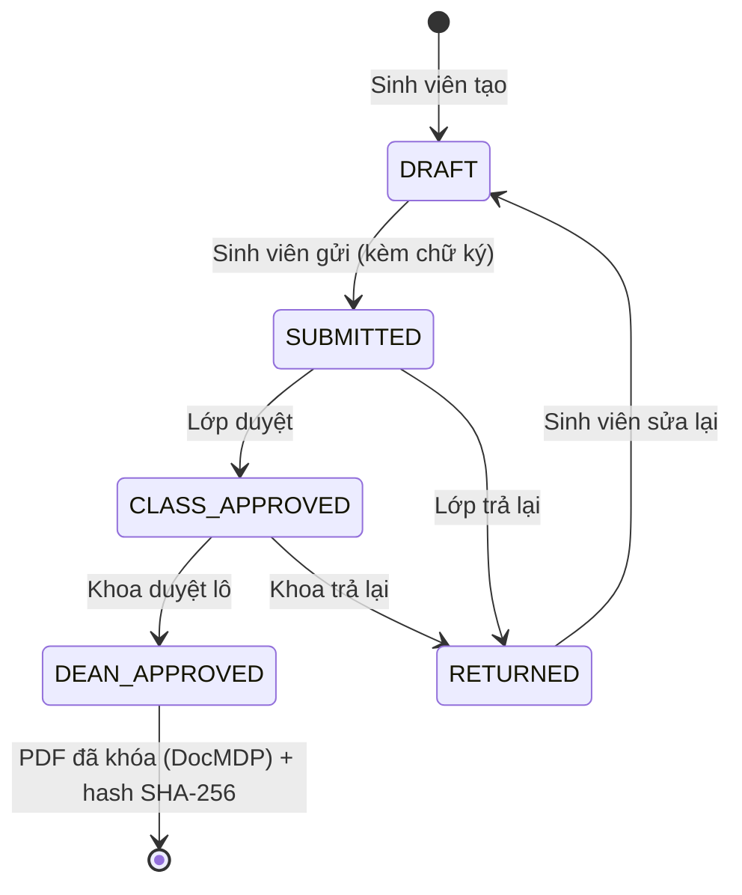
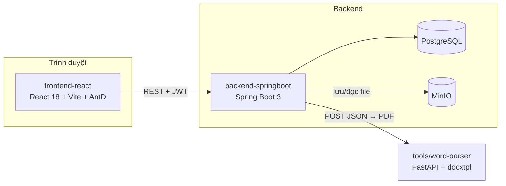
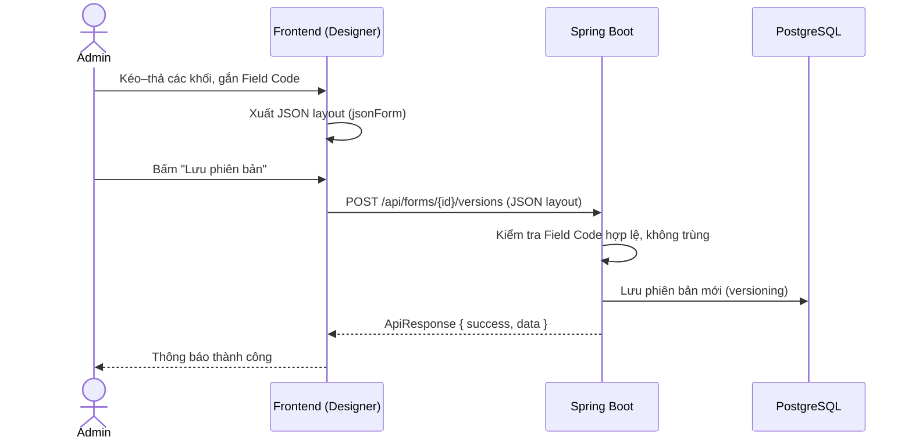
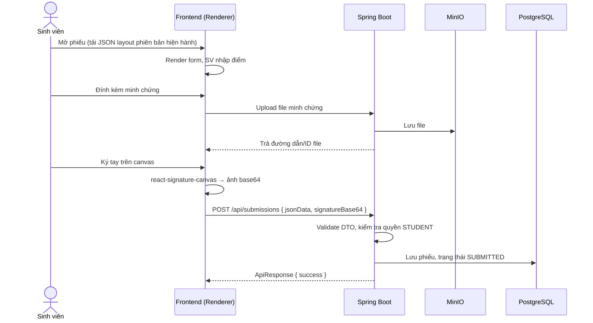
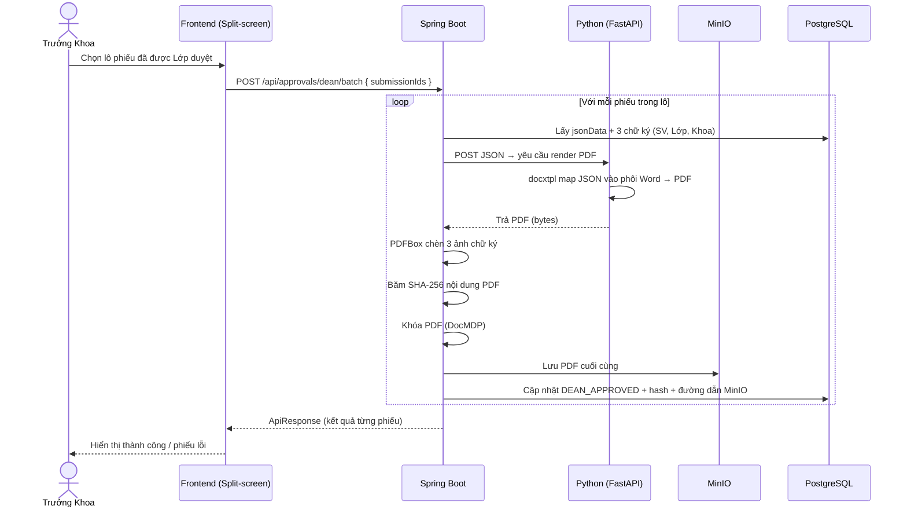

# PROJECT STRUCTURE — Hệ thống E-Form Điểm Rèn Luyện (ĐRL)

> **Dành cho ai?** Developer mới vào dự án, hoặc AI Assistant (Cursor / Copilot / Claude Code) cần nắm kiến trúc trước khi sinh code (phương pháp **Vibecoding**).
> **Dùng thế nào?** Đọc mục 1 → 3 để có "bản đồ", mục 5 → 6 trước khi viết code. Khi nhờ AI code, **dán nguyên tài liệu này (hoặc mục 3 + mục 6) vào ngữ cảnh**.

> 🔒 **Lưu ý bảo mật:** tài liệu chỉ mô tả CẤU TRÚC và LOGIC. Mọi URL máy chủ, mật khẩu, khoá JWT, access key MinIO đều dùng placeholder (`<JWT_SECRET>`, `<MINIO_ACCESS_KEY>`...). Không commit giá trị thật vào repo/chat.

---

## Mục lục

1. [Tổng quan dự án](#1-tổng-quan-dự-án)
2. [Tech Stack](#2-tech-stack)
3. [Kiến trúc cây thư mục (Monorepo 3 phần)](#3-kiến-trúc-cây-thư-mục-monorepo-3-phần)
   - [3.1 Sơ đồ kiến trúc tổng thể](#31-sơ-đồ-kiến-trúc-tổng-thể)
   - [3.2 `frontend-react/`](#32-frontend-react)
   - [3.3 `backend-springboot/`](#33-backend-springboot)
   - [3.4 `tools/word-parser/`](#34-toolsword-parser)
4. [8 Module nghiệp vụ](#4-8-module-nghiệp-vụ)
5. [Luồng xử lý (Data Flow)](#5-luồng-xử-lý-data-flow)
   - [5.1 Admin tạo biểu mẫu → sinh JSON](#51-luồng-1--admin-tạo-biểu-mẫu--sinh-json)
   - [5.2 Sinh viên tự chấm → gửi JSON + chữ ký base64](#52-luồng-2--sinh-viên-nhập-điểm--gửi-json--chữ-ký-base64)
   - [5.3 Trưởng Khoa duyệt lô → PDF, ký, băm, lưu MinIO](#53-luồng-3--trưởng-khoa-duyệt-lô)
6. [Quy tắc Vibecoding cho người mới / AI](#6-quy-tắc-vibecoding-cho-người-mới--ai)
7. [Phụ lục: Glossary & Checklist](#7-phụ-lục)

---

## 1. Tổng quan dự án

**Hệ thống E-Form ĐRL** số hóa toàn bộ quy trình đánh giá điểm rèn luyện của sinh viên trong trường đại học: từ thiết kế biểu mẫu, sinh viên tự chấm, đến lớp/khoa phê duyệt và lưu trữ bản PDF có giá trị chứng cứ.

### 3 bài toán lõi

| # | Bài toán | Người dùng chính | Điểm kỹ thuật đáng chú ý |
|---|---|---|---|
| 1 | **Form Builder** — Admin tự thiết kế biểu mẫu động | `ADMIN` | Layout lưu dạng **JSON**, có phiên bản (versioning), gắn **Field Code** |
| 2 | **Sinh viên tự chấm** — nhập điểm, đính kèm minh chứng, ký tay | `STUDENT` | Ký tay trên canvas → ảnh **base64**; upload minh chứng |
| 3 | **Duyệt bài** — Lớp & Khoa duyệt qua giao diện **Split-screen** | `CLASS_LEADER`, `DEAN` | Tự động đóng **chữ ký 3 cấp**, băm **SHA-256**, khóa PDF bằng **DocMDP** |

### Vai trò (RBAC)

| Role | Mô tả ngắn | Quyền chính |
|---|---|---|
| `STUDENT` | Sinh viên | Soạn, lưu nháp, gửi phiếu ĐRL của chính mình |
| `CLASS_LEADER` | Lớp trưởng / cán bộ lớp | Duyệt phiếu của sinh viên trong lớp |
| `DEAN` | Trưởng Khoa | Duyệt lô cấp Khoa, ký chốt, xem báo cáo khoa |
| `ADMIN` | Quản trị hệ thống | Thiết kế biểu mẫu, danh bạ đơn vị, báo cáo toàn trường |

### Vòng đời một phiếu ĐRL



> Tên trạng thái trên là **quy ước đề xuất**; giá trị thật nằm trong `enu/` của backend. Khi mâu thuẫn, **tin code**.

---

## 2. Tech Stack

| Phân hệ | Công nghệ | Vai trò |
|---|---|---|
| **Frontend** | React 18, Vite | SPA, build nhanh |
| | Ant Design v5 | UI library (bảng, form, layout, modal) |
| | Zustand | State management theo từng domain |
| | React Hook Form | Quản lý form + validate |
| | react-signature-canvas | Vẽ chữ ký tay → base64 |
| **Backend** | Spring Boot 3, Java 17 | REST API |
| | PostgreSQL + Spring Data JPA | Lưu trữ quan hệ, CRUD qua `JpaRepository` |
| | Hibernate Criteria API | Lọc động đa chiều (báo cáo) |
| | Spring Security + JWT | Xác thực/phân quyền 4 role |
| | Apache PDFBox | Chèn ảnh chữ ký, băm, khóa DocMDP |
| | Apache POI | Đọc/ghi Excel (import danh bạ, xuất báo cáo) |
| | MinIO | Object storage cho PDF, minh chứng |
| **Python Microservice** | FastAPI | HTTP service nhỏ |
| | `docxtpl` | Map JSON vào phôi Word (`.docx`) rồi xuất PDF |

---

## 3. Kiến trúc cây thư mục (Monorepo 3 phần)

### 3.1 Sơ đồ kiến trúc tổng thể



### Cấu trúc gốc repo

```text
drl-eform/
├── frontend-react/          # Giao diện React (SPA)
├── backend-springboot/      # REST API, nghiệp vụ, PDF engine
├── tools/
│   └── word-parser/         # Microservice Python: Word template → PDF
├── docs/                    # SRS, tài liệu API (nếu có)
├── docker-compose.yml       # PostgreSQL, MinIO, các service (chạy local)
└── project_structure.md     # ← tài liệu này
```

### 3.2 `frontend-react/`

```text
frontend-react/
├── index.html
├── vite.config.js
├── package.json
└── src/
    ├── main.jsx                     # Entry: mount App, ConfigProvider (AntD)
    ├── App.jsx                      # Router + guard theo role
    │
    ├── common/                      # Hằng số & cấu hình dùng chung toàn app
    │   ├── constants.js             #   Role, trạng thái phiếu, page size mặc định
    │   ├── messages.js              #   Mọi chuỗi thông báo hiển thị cho user
    │   ├── permission-config.js     #   Menu sidebar + route nào role nào được vào
    │   └── theme.js                 #   Token màu sắc AntD
    │
    ├── components/                  # Component tái sử dụng
    │   ├── form-builder/            #   ★ Công cụ thiết kế biểu mẫu (Admin)
    │   │   ├── Designer.jsx         #     Canvas kéo–thả, xuất JSON layout
    │   │   ├── Renderer.jsx         #     Đọc JSON layout → render form cho sinh viên
    │   │   ├── blocks/              #     Từng khối: ô điểm, bảng tiêu chí, ô minh chứng...
    │   │   └── field-code/          #     Gắn/kiểm tra Field Code cho từng khối
    │   ├── signature/               #   Bọc react-signature-canvas, trả về base64
    │   ├── split-screen/            #   Layout 2 cột: danh sách bài | chi tiết/PDF
    │   └── ui/                      #   Nút, bảng, select... dùng chung
    │
    ├── lib/
    │   └── axios/                   # Cấu hình HTTP client
    │       ├── client.js            #   Axios instance, gắn JWT, interceptor lỗi/401
    │       └── api-paths.js         #   Tập trung toàn bộ URL endpoint
    │
    ├── pages/                       # Mỗi thư mục = 1 màn hình/route
    │   ├── login/
    │   ├── admin/                   #   Form builder, danh bạ đơn vị, báo cáo
    │   ├── student/                 #   Soạn phiếu, lịch sử
    │   ├── class-leader/            #   Hàng đợi duyệt cấp lớp (split-screen)
    │   └── dean/                    #   Duyệt lô cấp khoa
    │
    ├── services/                    # Gọi API (1 file / domain) — KHÔNG gọi axios trong component
    │   ├── auth-service.js
    │   ├── form-service.js
    │   ├── submission-service.js
    │   └── ...
    │
    └── stores/                      # Zustand store theo domain
        ├── useAuthStore.js
        ├── useFormBuilderStore.js
        └── useSubmissionStore.js
```

**Luồng gọi chuẩn phía FE:** `pages/` → `stores/` → `services/` → `lib/axios/`.

| Thư mục | Trách nhiệm | KHÔNG làm |
|---|---|---|
| `pages/` | Ghép layout, gọi store | Không gọi axios trực tiếp |
| `components/` | Hiển thị, nhận props | Không chứa logic gọi API |
| `stores/` | Giữ state, gọi service, xử lý loading/lỗi | Không render UI |
| `services/` | Gọi endpoint, **chuyển đổi phân trang 1-based ↔ 0-based** | Không giữ state |
| `lib/axios/` | Instance + interceptor (JWT, lỗi chung) | Không chứa nghiệp vụ |
| `common/` | Hằng số, message, cấu hình quyền | Không import từ `pages/` |

### 3.3 `backend-springboot/`

```text
backend-springboot/
├── pom.xml
└── src/main/
    ├── resources/
    │   └── application.yml          # Cấu hình (giá trị nhạy cảm dùng biến môi trường)
    └── java/<base.package>/
        ├── DrlApplication.java
        │
        ├── Wrapper/                 # ★ Lớp bọc response chuẩn cho MỌI API
        │   ├── ApiResponse.java     #   { success, code, message, data, timestamp }
        │   └── PageWrapper.java     #   { content, page, size, totalElements, totalPages }
        │
        ├── controller/              # REST endpoint — mỏng, chỉ nhận/trả, gọi service
        ├── dto/
        │   ├── request/             #   Dữ liệu client gửi lên (kèm @Valid)
        │   └── response/            #   Dữ liệu trả về client
        │
        ├── dao/                     # Spring Data JpaRepository (CRUD, query đơn giản)
        ├── hibernateDao/            # ★ Criteria API — lọc động đa chiều (báo cáo, tìm kiếm)
        │
        ├── enu/                     # Enum: Role, SubmissionStatus, ApprovalLevel...
        ├── model/                   # Entity JPA ánh xạ bảng PostgreSQL
        │
        ├── security/                # JWT filter, UserDetails, SecurityConfig, @PreAuthorize
        │
        └── service/                 # Nghiệp vụ (@Transactional)
            └── engine/              # ★ Xử lý PDF & gọi Python
                ├── PythonRenderClient.java   #   Gọi FastAPI: JSON → PDF
                ├── PdfSignatureEngine.java   #   PDFBox: chèn 3 ảnh chữ ký
                ├── PdfHashEngine.java        #   Băm SHA-256
                └── PdfLockEngine.java        #   Khóa DocMDP
```

| Thư mục | Trách nhiệm | Quy tắc |
|---|---|---|
| `Wrapper/` | Định dạng response thống nhất | Controller **luôn** trả `ApiResponse<T>` |
| `controller/` | Routing, validate đầu vào, phân quyền | Không chứa nghiệp vụ |
| `dto/request/`, `dto/response/` | Hợp đồng dữ liệu với FE | Không trả thẳng Entity ra ngoài |
| `dao/` | `JpaRepository` — CRUD, derived query | Truy vấn cố định |
| `hibernateDao/` | Criteria API — điều kiện lọc **thay đổi theo input** | Dùng khi bộ lọc ≥ 3 chiều tùy chọn (khoa, lớp, kỳ, trạng thái...) |
| `enu/` | Enum nghiệp vụ | Tên thư mục `enu` (tránh trùng từ khóa `enum`) |
| `model/` | Entity JPA | Chỉ ánh xạ bảng |
| `security/` | JWT + 4 role | Role: `STUDENT`, `CLASS_LEADER`, `DEAN`, `ADMIN` |
| `service/` | Nghiệp vụ, transaction | Gọi `dao/`, `hibernateDao/`, `engine/` |
| `service/engine/` | PDF + giao tiếp Python | Tách riêng khỏi nghiệp vụ để dễ test |

> **Chọn `dao/` hay `hibernateDao/`?** Truy vấn cố định (theo id, theo mã sinh viên) → `dao/`. Truy vấn có bộ lọc tùy chọn ghép động (đặc biệt Module 8 – Báo cáo) → `hibernateDao/`.

### 3.4 `tools/word-parser/`

```text
tools/word-parser/
├── main.py              # FastAPI app: nhận JSON + template → trả PDF
├── requirements.txt     # fastapi, uvicorn, docxtpl, ...
├── templates/           # Phôi Word (.docx) chứa placeholder {{ field_code }}
└── Dockerfile
```

| Việc | Mô tả |
|---|---|
| Vai trò | Microservice **không trạng thái**: nhận JSON dữ liệu → map vào phôi Word bằng `docxtpl` → xuất PDF |
| Điểm kết nối | Chỉ **Spring Boot** gọi service này (qua `PythonRenderClient`); frontend **không** gọi trực tiếp |
| Khóa map dữ liệu | `Field Code` (Module 4) là cầu nối: tên placeholder trong Word = Field Code trong JSON |

---

## 4. 8 Module nghiệp vụ

Ánh xạ từ tài liệu SRS. Cột "Nơi code" là gợi ý vị trí chính để tìm/sửa.

| # | Module | Mô tả ngắn | Nơi code chính |
|---|---|---|---|
| 1 | **Auth & RBAC** | Đăng nhập, JWT, phân quyền 4 role | BE: `security/`, `controller/Auth*` · FE: `useAuthStore`, `permission-config.js` |
| 2 | **Danh bạ đơn vị** | Quản lý Khoa/Lớp/Sinh viên; **import Excel** | BE: Apache POI trong `service/` · FE: `pages/admin/` |
| 3 | **Phiên bản biểu mẫu** | Lưu layout dạng **JSON**, quản lý phiên bản | BE: `model/FormVersion` · FE: `components/form-builder/` |
| 4 | **Field Code** | Mã định danh trường; nối form ↔ phôi Word | BE: `service/` · FE: `form-builder/field-code/` |
| 5 | **Hàng đợi & Phê duyệt (Checker)** | Danh sách chờ duyệt, split-screen, duyệt/trả lại | FE: `pages/class-leader/`, `pages/dean/`, `split-screen/` · BE: `service/` + `engine/` |
| 6 | **Thông báo** | Báo cho sinh viên/người duyệt khi đổi trạng thái | BE: `service/Notification*` · FE: store + chuông thông báo |
| 7 | **Soạn thảo (Maker)** | Sinh viên điền điểm, minh chứng, ký tay, gửi | FE: `pages/student/`, `signature/`, `Renderer.jsx` |
| 8 | **Báo cáo toàn trường** | Thống kê đa chiều, xuất Excel | BE: **`hibernateDao/`** (Criteria API) + POI |

---

## 5. Luồng xử lý (Data Flow)

### 5.1 Luồng 1 — Admin tạo biểu mẫu → sinh JSON



**Điểm cần nhớ:** JSON layout là **nguồn sự thật** của biểu mẫu. `Renderer.jsx` (phía sinh viên) và phôi Word (phía Python) đều bám theo **Field Code** trong JSON này.

### 5.2 Luồng 2 — Sinh viên nhập điểm → gửi JSON + chữ ký base64



| Dữ liệu gửi lên | Định dạng | Ghi chú |
|---|---|---|
| `jsonData` | JSON: `{ "<field_code>": value, ... }` | Key chính là **Field Code** |
| `signatureBase64` | Chuỗi base64 (PNG) | Backend giải mã, lưu/giữ để chèn vào PDF sau |
| Minh chứng | File upload (multipart) | Lưu MinIO, DB chỉ giữ tham chiếu |

### 5.3 Luồng 3 — Trưởng Khoa duyệt lô



**Thứ tự xử lý trong `service/engine/` (không đảo):**

| Bước | Engine | Lý do thứ tự |
|---|---|---|
| 1 | `PythonRenderClient` — JSON → PDF | Cần PDF gốc trước |
| 2 | `PdfSignatureEngine` — chèn 3 ảnh chữ ký | Nội dung phải hoàn chỉnh trước khi băm |
| 3 | `PdfHashEngine` — SHA-256 | Băm **sau** khi chèn chữ ký để hash phản ánh bản cuối |
| 4 | `PdfLockEngine` — DocMDP | Khóa chống chỉnh sửa sau cùng |
| 5 | Lưu MinIO + cập nhật DB | Chỉ lưu khi các bước trước thành công |

> ⚠️ **Lưu ý thiết kế:** nếu bước DocMDP ghi thêm dữ liệu vào PDF (incremental save), hash tính ở bước 3 sẽ không còn khớp bản cuối. Hãy chốt rõ trong code: **băm trên bản đã khóa** (đổi thứ tự 3 ↔ 4) hay lưu hash của bản trước khi khóa. Khuyến nghị: băm bản cuối cùng sẽ lưu vào MinIO.
>
> Ngoài ra, DocMDP là cơ chế "chứng nhận tài liệu" trong chuẩn PDF và cần một chứng thư số (certificate) để ký. Ảnh chữ ký chỉ là hình ảnh hiển thị, không phải chữ ký số có giá trị mật mã.

---

## 6. Quy tắc Vibecoding cho người mới / AI

### 6.1 Quy tắc phân trang (dễ sai nhất)

| Phía | Quy ước | Ví dụ trang đầu tiên |
|---|---|---|
| **Frontend** (AntD `Table`) | **1-based** | `current = 1` |
| **Backend** (Spring Data `Pageable`) | **0-based** | `page = 0` |

- Chuyển đổi thực hiện **một chỗ duy nhất: tầng `services/` của FE**.
- Component và store luôn dùng 1-based; không tự trừ 1 rải rác.

```js
// frontend-react/src/services/submission-service.js
export const fetchSubmissions = ({ page, size, ...filters }) =>
  client.get(API_PATHS.SUBMISSIONS, {
    params: { page: page - 1, size, ...filters }, // FE 1-based → BE 0-based
  });
```

```js
// Khi nhận response: BE trả 0-based → FE hiển thị 1-based
const current = data.page + 1;
```

### 6.2 Bọc Response — luôn qua `Wrapper/`

Mọi controller Spring Boot **phải** trả `ApiResponse<T>`; danh sách phân trang dùng thêm `PageWrapper<T>`.

```json
{
  "success": true,
  "code": "OK",
  "message": "Thành công",
  "data": { },
  "timestamp": "2026-10-02T09:00:00Z"
}
```

```java
@GetMapping("/{id}")
public ApiResponse<SubmissionResponse> getById(@PathVariable Long id) {
    return ApiResponse.ok(submissionService.getById(id));
}
```

| Làm | Không làm |
|---|---|
| `return ApiResponse.ok(...)` | Trả thẳng Entity hoặc `List<>` |
| Dùng `PageWrapper` cho danh sách | Trả `Page<>` thô của Spring |
| Lỗi qua exception handler → `ApiResponse` lỗi | `try/catch` rồi trả chuỗi tự do |

### 6.3 Prompting Context — luôn cho AI biết "đặt file ở đâu"

AI viết code tốt nhất khi biết **đường dẫn + vai trò thư mục**. Luôn kèm bối cảnh thư mục trong prompt.

| Cần tạo | Đặt ở | Ghi chú cho AI |
|---|---|---|
| DTO nhận dữ liệu từ client | `backend-springboot/.../dto/request/` | Thêm `@Valid`, không dùng Entity |
| DTO trả về | `.../dto/response/` | Không lộ trường nội bộ |
| Repository CRUD | `.../dao/` | Extends `JpaRepository` |
| Truy vấn lọc động | `.../hibernateDao/` | Dùng Criteria API, không nối chuỗi JPQL |
| Logic PDF / gọi Python | `.../service/engine/` | Tách khỏi service nghiệp vụ |
| Enum | `.../enu/` | — |
| Gọi API từ FE | `frontend-react/src/services/` | Đổi page 1-based → 0-based tại đây |
| State | `frontend-react/src/stores/` | Zustand, 1 store / domain |
| Khối form-builder | `frontend-react/src/components/form-builder/blocks/` | Khai báo kèm Field Code |
| Chuỗi hiển thị | `frontend-react/src/common/messages.js` | Không hard-code trong component |

**Mẫu prompt tốt:**

```text
Bối cảnh: dự án monorepo ĐRL (xem project_structure.md).
Tạo `SubmissionFilterRequest` ở backend-springboot/.../dto/request/
(khoa, lớp, kỳ học, trạng thái - tất cả optional).
Tạo `SubmissionReportHibernateDao` ở .../hibernateDao/ dùng Criteria API
để lọc động theo request trên, trả PageWrapper<SubmissionResponse>.
Controller trả ApiResponse<PageWrapper<...>>; page ở backend là 0-based.
```

**Mẫu prompt xấu:** `Viết API lọc báo cáo` — thiếu vị trí, thiếu quy ước → AI tự đoán cấu trúc.

### 6.4 Checklist trước khi tạo Pull Request

```text
[ ] File mới nằm đúng thư mục theo bảng 6.3
[ ] Controller trả ApiResponse<T> (không trả Entity)
[ ] Phân trang: FE 1-based, BE 0-based, chuyển đổi chỉ ở services/
[ ] Truy vấn lọc động đặt ở hibernateDao/, không nhét vào dao/
[ ] Endpoint mới có @PreAuthorize đúng role
[ ] Chuỗi hiển thị nằm trong common/messages.js
[ ] Không commit URL, key, mật khẩu thật
```

---

## 7. Phụ lục

### Glossary

| Thuật ngữ | Ý nghĩa |
|---|---|
| **ĐRL** | Điểm rèn luyện |
| **Maker / Checker** | Người soạn (sinh viên) / người duyệt (lớp, khoa) |
| **Form Builder** | Công cụ Admin thiết kế biểu mẫu kéo–thả |
| **jsonForm / layout** | JSON mô tả giao diện biểu mẫu |
| **jsonData** | JSON giá trị sinh viên nhập, key = Field Code |
| **Field Code** | Mã định danh trường, nối form ↔ phôi Word |
| **Split-screen** | Giao diện 2 cột: danh sách bài và chi tiết |
| **SHA-256** | Hàm băm xác minh toàn vẹn PDF |
| **DocMDP** | Cơ chế chứng nhận PDF, hạn chế chỉnh sửa sau khi ký |
| **MinIO** | Object storage tương thích S3 |
| **docxtpl** | Thư viện Python điền dữ liệu vào template Word |

### Checklist cho người mới

```text
[ ] Hiểu 3 bài toán lõi và 4 role (mục 1)
[ ] Nắm kiến trúc FE ↔ Spring Boot ↔ Python (mục 3.1)
[ ] Biết luồng FE: pages → stores → services → lib/axios (mục 3.2)
[ ] Phân biệt dao/ và hibernateDao/ (mục 3.3)
[ ] Đọc 3 luồng xử lý (mục 5), đặc biệt thứ tự engine ở 5.3
[ ] Thuộc 2 quy tắc: phân trang 1/0-based và bọc ApiResponse (mục 6)
[ ] Biết đặt file mới ở đâu trước khi nhờ AI code (mục 6.3)
```
